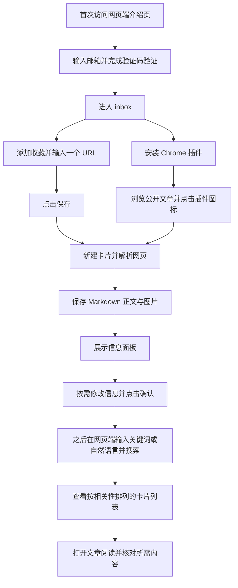

# PRD：网页收藏与再查找 MVP

日期：2026-09-13  
交付定位：可供真实用户使用的 MVP。本文记录已确认的产品需求，不代表最终产品形态或已实现能力。  
决策依据：本次需求讨论中用户最终确认的范围；未决事项在相应标题下标记为“尚未决定”。

## 1. 问题陈述

经常通过互联网开展行业研究、趋势追踪和信息搜集的知识工作者，需要一种便捷方式收藏阅读中发现的网页。即使已经收藏，他们仍可能在之后的研究任务中难以重新找到所需内容。便捷收藏需求与收藏后二次查找困难是本 MVP 要验证的两个产品假设，不作为已被普遍证实的事实。

## 2. 解决方案

提供 Chrome 桌面插件和网页端，让用户主动收藏网页、保存可阅读的文章内容，并通过全文与语义混合检索找回已保存的文章。

## 3. 用户故事

1. 作为行业分析师，我希望在网页端了解产品解决的问题，以便判断是否适合自己的研究工作。
2. 作为首次使用者，我希望通过邮箱验证码完成注册，以便建立个人收藏库而无需设置密码。
3. 作为已有用户，我希望通过同一邮箱验证码入口登录，以便继续访问自己的资料。
4. 作为用户，我希望网页端和插件端使用同一账号与收藏库，以便在不同入口完成收藏和管理。
5. 作为用户，我希望知道收藏数据如何上云、是否交由第三方处理以及是否用于训练，以便理解数据用途。
6. 作为首次使用者，我希望不安装插件也能添加一个 URL，以便先体验完整的收藏与查找流程。
7. 作为用户，我希望从空收藏列表或设置页找到 Chrome 插件安装入口，以便之后快速收藏。
8. 作为已登录的插件用户，我希望点击插件图标即可收藏当前网页，以便完成一次主动保存。
9. 作为未登录的插件用户，我希望能跳转网页端登录，并在返回目标页面后主动触发收藏，以便保存正确的页面。
10. 作为网页端用户，我希望每次输入一个 URL 添加收藏，以便把网页纳入个人资料库。
11. 作为用户，我希望每次提交收藏都生成独立卡片，以便保留每次主动保存的记录。
12. 作为用户，我希望新收藏默认进入 inbox 并使用网页标题，以便不填写额外信息也能完成收藏。
13. 作为用户，我希望解析成功后直接编辑标题、标签、保存位置和描述，以便补充个人上下文。
14. 作为用户，我希望离开编辑字段时保存修改，并用“确认”结束操作，以便完成信息补充。
15. 作为用户，我希望关闭已提交任务的面板后收藏仍继续处理，以便返回阅读。
16. 作为用户，我希望成功解析的文章保存文本和图片，以便在网页端阅读保存内容。
17. 作为用户，我希望解析失败时仍保留链接卡片，以便重试或访问原网页。
18. 作为用户，我希望首次收藏解析失败后能在原面板重试，以便继续完成收藏。
19. 作为用户，我希望部分图片保存失败时仍能阅读正文并识别缺失位置，以便判断内容是否完整。
20. 作为用户，我希望打开解析失败的网页卡片后能重新解析或在新标签页访问原文，以便继续获取资料。
21. 作为用户，我希望浏览 inbox、全部收藏或某个文件夹，以便查看相应收藏。
22. 作为用户，我希望收藏以每行一张的卡片列表展示并按收藏时间倒序排列，以便先看到近期保存内容。
23. 作为用户，我希望卡片展示标题、来源站点、收藏时间、类型和标签，以便识别内容。
24. 作为用户，我希望创建、重命名和删除单层文件夹，以便组织收藏。
25. 作为用户，我希望删除文件夹时内容回到 inbox，以便避免因整理目录丢失收藏。
26. 作为用户，我希望修改卡片所属文件夹，以便调整内容位置。
27. 作为用户，我希望为卡片添加多个标签或不设置标签，以便按需记录个人线索。
28. 作为用户，我希望选择已有标签、创建标签或移除卡片标签，以便维护卡片信息。
29. 作为用户，我希望在设置中全局重命名或删除标签，以便统一管理标签名称。
30. 作为用户，我希望通过卡片操作复制原始链接，以便在其他工作中使用来源。
31. 作为用户，我希望确认后删除收藏及其保存内容，以便移除不再需要的资料。
32. 作为用户，我希望用关键词或自然语言描述搜索文章，以便不记得准确标题时仍能查找。
33. 作为用户，我希望搜索同时利用全文和语义匹配，以便通过不同文字线索找到内容。
34. 作为用户，我希望用中文查找英文文章，或用英文查找中文文章，以便跨语言调用资料。
35. 作为用户，我希望搜索覆盖全部已成功解析文章的标题和正文，以便不受当前文件夹限制。
36. 作为用户，我希望结果按相关性呈现为卡片，以便打开并核对候选文章。
37. 作为用户，我希望无结果时获得调整查询的提示，搜索失败时保留输入并可重试，以便继续查找。
38. 作为用户，我希望清空查询后返回原收藏列表，以便继续浏览。
39. 作为用户，我希望以阅读视图查看 Markdown 正文及保存图片，以便直接阅读文章。
40. 作为用户，我希望通过底部“更多”访问操作和卡片详情，以便按需查看来源与管理内容。
41. 作为用户，我希望从卡片详情打开来源链接，以便核对原网页。
42. 作为用户，我希望编辑 Markdown 正文并预览，以便修正解析错误和图片引用。
43. 作为用户，我希望识别正文经过手动编辑，并在重新解析替换前获得覆盖提示，以便避免无意丢失修正。
44. 作为用户，我希望对已有卡片重新解析后先查看新结果再确认使用，以便决定是否替换正文。
45. 作为用户，我希望重新解析失败或退出确认页时保留旧内容，以便继续使用已有资料。
46. 作为用户，我希望从文章返回时保留搜索词和列表位置，以便继续检查其他结果。

## 4. 用户旅程与主流程

以下仅描述成功路径，不包含失败、重试或取消分支。



## 5. 功能矩阵

优先级（P0/P1）：**尚未决定**。下表功能均已确认进入 MVP，不因优先级未定而成为选做项。

| 功能点 | 功能描述 | 优先级（P0/P1） | 进入 MVP 理由 |
|---|---|---|---|
| 介绍与首次使用 | 介绍页、登录后 inbox、添加收藏及插件安装入口 | 尚未决定 | 支持用户从网页端接触并开始使用产品。 |
| 邮箱账号 | 邮箱验证码统一注册／登录，个人账号双端同步 | 尚未决定 | 让两端访问同一份个人资料。 |
| 数据用途说明 | 明确云端存储、第三方处理和不用于训练的规则 | 尚未决定 | 让用户理解收藏数据的处理方式。 |
| 插件收藏 | 点击图标保存当前页面，未登录时引导登录 | 尚未决定 | 提供浏览中的便捷收藏入口。 |
| 网页端收藏 | 每次输入一个 URL，提交后保存 | 尚未决定 | 支持不安装插件也能收藏。 |
| 内容解析与保存 | 公开网页解析为 Markdown 并保存图片 | 尚未决定 | 提供可阅读、可检索的文章内容。 |
| 保存后信息编辑 | 默认 inbox 与网页标题，成功后编辑四项信息 | 尚未决定 | 保留便捷保存与个人组织能力。 |
| 首次收藏失败重试 | 保留网页卡片，重试成功自动保存 | 尚未决定 | 允许恢复首次解析失败的收藏。 |
| 收藏列表 | 单列卡片、倒序、全部收藏与文件夹浏览 | 尚未决定 | 提供二次查看和管理入口。 |
| 文件夹 | 单层文件夹管理、移动、删除后移回 inbox | 尚未决定 | 支持保存位置管理。 |
| 标签 | 多标签选择、新建、移除及全局管理 | 尚未决定 | 保存用户自定义的内容线索。 |
| 卡片操作与详情 | 编辑信息、重新解析正文、复制链接、删除、详情 | 尚未决定 | 覆盖收藏的基础维护与来源查看。 |
| 文章阅读与修正 | 阅读视图、Markdown 编辑及预览、用户编辑标记 | 尚未决定 | 支持阅读保存内容并修正解析错误。 |
| 已有卡片重新解析 | 查看新解析结果，确认后替换 | 尚未决定 | 让正文更新经过用户检查。 |
| 混合搜索 | 全文与语义检索标题、正文，中英文双向查找 | 尚未决定 | 验证收藏后二次查找的核心价值。 |
| 删除收藏 | 确认后删除卡片、正文、图片及索引，无回收站 | 尚未决定 | 支持用户移除不需要的资料。 |

## 6. 详细 UI／UX 逻辑

### 6.1 页面层级

下图表达已确认的功能承载关系；独立页面的最终数量、未明确面板的弹窗／抽屉形式及复用方式：**尚未决定**。已指定的面板与页面形态按图中说明执行。

```text
网页端
├── 产品介绍页
│   ├── 产品说明：收藏网页，按关键词或描述找回
│   └── 邮箱注册／登录入口
├── 邮箱验证码注册／登录界面
├── 收藏库（登录后默认 inbox）
│   ├── 侧栏：全部收藏、inbox、自定义文件夹
│   ├── 搜索框与搜索按钮
│   ├── 单列卡片列表／搜索结果／空状态
│   │   └── 卡片右上角“更多”操作菜单
│   ├── 添加收藏界面：URL 输入与保存
│   │   ├── 保存／解析处理中状态
│   │   ├── 成功信息面板：四项可编辑信息、确认按钮
│   │   └── 失败状态：提示、重新解析按钮
│   ├── 文件夹管理界面
│   └── 卡片编辑信息界面
├── 文章详情页
│   ├── 正文与图片阅读视图
│   ├── 返回列表入口
│   └── 底部悬浮“更多”按钮 → 操作面板
│       ├── 编辑信息／重新解析正文／复制链接／删除收藏
│       ├── 卡片详情 → 标题、链接、时间、类型、文件夹、标签、描述
│       └── 编辑正文 → Markdown 编辑器、预览、保存、取消
├── 网页卡片内容界面（解析失败）
│   └── 失败文案、重新解析正文、在浏览器访问
├── 重新解析结果确定页（已有卡片操作）
│   ├── 成功：新解析结果、确定使用该解析结果
│   ├── 失败：失败文案、在浏览器访问
│   └── 返回入口
└── 设置页
    ├── 标签管理
    ├── 插件安装入口
    └── 数据用途说明及控制（具体控制项尚未决定）

Chrome 插件面板
├── 未登录：请先登录 → 网页端登录
├── 已登录点击图标：立即保存当前页面并显示处理中状态
├── 首次解析成功／重试成功：信息面板、确认按钮
└── 解析失败：失败文案、重新解析按钮

共用确认交互
├── 删除收藏确认
├── 删除自定义文件夹确认
└── 全局删除标签确认
```

### 6.2 账号、首次访问与支持环境

- 支持 Chrome 桌面插件；网页端以 Chrome 桌面版为验收环境。不承诺 Edge、Firefox、Safari 兼容，不提供桌面或移动 App。
- 界面为简体中文；解析与检索覆盖中英文文章，支持中文查询英文文章及英文查询中文文章。
- 未登录访问网页端时展示产品介绍与注册／登录入口。邮箱验证码验证成功后，未注册邮箱创建账号，已有账号直接登录；无需密码。
- 登录后直接进入 inbox，不设置强制引导。空 inbox 提供“添加收藏”和“安装 Chrome 插件”；设置页也提供插件安装入口。
- 未登录点击插件图标时显示“请先登录”，按钮在新标签页打开网页端登录。成功后同步插件登录状态，不自动收藏先前页面；用户回到目标网页再次点击图标才保存。
- 邮箱验证码时效、重发间隔、错误提示、会话期限、退出登录、注销账号及修改邮箱流程：**尚未决定**。

### 6.3 收藏对象与卡片信息

| 项目 | 已确认规则 |
|---|---|
| 收藏入口 | 统一入口，不设计独立 PDF／网页收藏入口。 |
| 支持内容 | 服务端根据 URL 获取无需登录即可访问的公开文章网页。 |
| 受限网页 | 不承诺登录、付费或验证码页面解析成功；不读取或上传浏览器登录凭据，解析失败走网页卡片流程。 |
| 不支持内容 | PDF 收藏、视频保存；正文保存文本与图片。 |
| 重复 URL | 不去重、不合并、不提醒，每次提交收藏新建独立卡片；同一卡片的解析重试不新建卡片。 |
| 卡片类型 | 仅“网页”“文章”；成功解析并保存正文为文章，解析失败或正文为空为网页。处理中的内部状态不作为第三种卡片类型。 |
| 标题 | 初次默认使用网页标题，用户可修改。 |
| 原始链接 | 保留提交的原始 URL，供复制与访问来源。 |
| 收藏时间 | 保留本次卡片初次收藏时间，重新解析不修改。 |
| 保存位置 | 默认 inbox，每张卡片只属于一个文件夹。 |
| 标签、描述 | 初始为空，用户按需填写；标签支持多个。 |

PDF 的不支持提示与识别时机、其他非文章 URL 的处理、无效 URL、网页标题无法获取、资源大小和超时限制：**尚未决定**。不设置解析前的“网页／PDF”产品分类步骤。

### 6.4 首次保存与成功信息面板

1. 插件已登录时点击图标立即收藏当前页；网页端点击“添加收藏”，输入一个 URL，再点击“保存”。不先展示标题、标签等编辑表单。
2. 提交后创建卡片并开始解析，初始信息使用默认值；展示处理中状态。提交任务后退出面板不取消任务，用户可在网页端查看结果。
3. 正文保存成功后展示信息面板，包含标题、标签、保存位置和描述。保存位置可选择已有文件夹，但此面板不提供新增文件夹入口。
4. 用户直接点击字段编辑，字段失焦即确认并保存该项修改。标签支持已有标签选择、创建及移除。
5. 面板底部仅有“确认”，不设计“关闭”按钮。“确认”保存当前信息，包括尚未失焦的字段，然后关闭面板。通过浏览器行为意外退出时，已保存修改保留。

网页端输入 URL 后取得默认标题的具体时机、保存请求本身失败时的重试与反馈、信息字段保存失败、处理中重复点击、意外退出时尚未失焦字段的处理：**尚未决定**。

### 6.5 首次解析失败、重试与部分图片失败

| 情形 | 已确认表现与数据行为 |
|---|---|
| 正文提取失败或为空 | 保留默认信息的网页卡片；双端原面板显示“解析失败，请重试”与“重新解析”按钮，不展示信息编辑面板。 |
| 首次收藏流程内重试成功 | 自动保存 Markdown 及图片，将当前卡片更新为文章，进入信息面板，底部只有“确认”。 |
| 首次收藏流程内重试再次失败 | 显示“解析失败”，保留重试按钮及网页卡片。 |
| 重试的信息保留 | 不新建卡片，不改变初次收藏时间、标题、标签、文件夹和描述。 |
| 正文成功但部分图片保存失败 | 仍为文章，显示“部分图片保存失败”，缺失图片位置显示占位提示。 |

索引的任何状态、提示和操作入口均不出现在 UI。文章成功保存后到可被搜索的时限、后台索引失败的恢复策略及图片失败提示的具体位置：**尚未决定**。

### 6.6 收藏列表、搜索结果与基础管理

- 默认显示 inbox；侧栏可进入“全部收藏”和各文件夹。列表采用单列卡片，每张卡片占一行。
- 收藏浏览按收藏时间从新到旧排列，不提供排序切换。卡片显示标题、来源站点、收藏时间、类型和标签，不显示正文摘要。
- 点击卡片打开内容；右上角“更多”提供编辑信息、重新解析正文、复制链接、删除收藏。完整信息由“卡片详情”承载。
- 空文件夹显示“暂无收藏”和“添加收藏”；空 inbox 另有插件安装入口。
- 编辑信息可修改标题、标签、保存位置和描述。已有卡片编辑信息界面的提交按钮及是否复用失焦保存方式：**尚未决定**。
- 卡片列表的分页／滚动加载、加载状态、标题截断、长标签展示及悬停视觉反馈：**尚未决定**。

### 6.7 文件夹与标签

- inbox 是系统文件夹，不可重命名或删除。
- 自定义文件夹支持创建、重命名、删除，不支持嵌套。通过“编辑信息”移动卡片。
- 删除文件夹前确认，确认后内部卡片移回 inbox，不删除卡片。
- 卡片可有多个标签或无标签；在编辑信息中选择已有标签、创建标签或移除卡片上的标签。
- 设置页支持标签全局重命名及删除。全局删除前确认，删除标签不删除卡片。
- 标签只用于记录与展示，不提供标签搜索、筛选或点击跳转。文件夹用于列表浏览，不限制搜索范围。
- 文件夹／标签的重名、空名称、长度和数量限制，以及创建／重命名表单形式：**尚未决定**。

### 6.8 混合搜索

| 项目 | 规则 |
|---|---|
| 入口与触发 | 网页端一个搜索框，输入后按 Enter 或点击搜索按钮执行。 |
| 检索方式 | 固定为全文检索＋语义检索，不提供“仅关键词”或其他模式切换。 |
| 范围 | 全部已成功解析文章的标题＋保存正文；不搜索标签、描述、URL，不识别图片内容。解析失败的网页不参与搜索。 |
| 文件夹关系 | 从任意文件夹执行搜索都覆盖全部文章；搜索框提示此范围。 |
| 语言 | 支持中英文及双向跨语言查找。 |
| 呈现 | 沿用单列卡片样式，按相关性排序；不显示命中片段、高亮或相关性分数，不提供筛选。 |
| 无结果 | “未找到相关文章，请尝试其他关键词或描述”。 |
| 请求失败 | “搜索失败，请重试”，保留输入，提供重试按钮。 |
| 清空查询 | 返回搜索前的收藏列表。 |

检索结果数量、分页、相关性阈值、混合排序策略、搜索速度与质量验收门槛：**尚未决定**。

### 6.9 文章阅读、卡片详情与正文编辑

- 点击文章卡片进入网页端文章详情，使用排版后的阅读视图呈现 Markdown 与保存图片，默认不展示源码。
- 底部悬浮“更多”，点击展开面板，提供四项卡片操作、“卡片详情”和文章专属的“编辑正文”。网页类型不提供编辑正文。
- 卡片详情展示标题、原始链接、收藏时间、类型、文件夹、标签和描述；原始链接可在浏览器新标签页打开。不增加名为“在浏览器中打开”的通用卡片操作。
- 编辑正文使用 Markdown 文本编辑器，可修改文本、删除或调整图片引用，提供预览、“保存”和“取消”。保存更新正文及搜索索引，标记“用户已编辑”；取消保留原内容。
- 重新解析拟替换手动编辑的正文时，在确认按钮附近明确提示会覆盖手动修改。
- 返回列表保留进入前的搜索词与列表位置。
- 不提供历史版本恢复、目录、高亮批注、阅读进度。
- 阅读视图具体排版、编辑器布局、正文编辑并发、损坏 Markdown 和新增图片引用的存储处理：**尚未决定**。

### 6.10 网页卡片与已有卡片重新解析

打开解析失败的网页卡片时显示：

> 原网页解析失败，请重新解析正文或者在浏览器访问原文

下方两个按钮为“重新解析正文”和“在浏览器访问”；后者在新标签页访问原始 URL，不内嵌原网页。产品不保存网页快照，失败卡片不能恢复原网页失效后的正文。

从已有卡片的操作或上述界面重新解析时，使用“重新解析结果确定页”：

| 情形 | 界面与行为 |
|---|---|
| 新结果成功 | 展示新解析正文，底部提供“确定使用该解析结果”。 |
| 用户确认 | 替换正文及图片，类型设为文章，更新搜索索引，返回文章详情。 |
| 再次失败 | 显示“页面解析失败，请在浏览器访问原网页”，提供“在浏览器访问”按钮，以新标签页打开原始 URL。 |
| 返回或关闭结果页 | 不提交新结果，保留原正文与卡片类型。成功及失败页均提供返回入口。 |
| 信息保留 | 无论是否替换正文，标题、标签、保存位置、描述与初次收藏时间不变。 |

首次收藏流程内的重试使用第 6.5 节的自动保存规则，不进入本结果确定页。重新解析结果的临时保留期限、处理中界面、部分图片失败的确认页布局和确认后“用户已编辑”标记的重置规则：**尚未决定**。

### 6.11 删除与复制

- “复制链接”复制卡片原始 URL。复制成功／失败的反馈文案：**尚未决定**。
- “删除收藏”先确认，确认后移除卡片、已保存正文、图片及搜索索引；不设回收站。
- 删除确认框具体文案、删除失败反馈，以及有解析任务或结果页打开时的删除协调：**尚未决定**。

### 6.12 数据存储、用途与设置

- 收藏信息、Markdown 与图片存储于云端；同一账号在支持环境中访问同一资料库。
- 只处理用户主动收藏的页面，不记录全量浏览历史；用户收藏内容不用于模型训练。
- 首次使用时明确说明哪些数据会上云；若语义检索将内容发往第三方服务，需明确披露。具体服务商与披露内容：**尚未决定**。
- 设置页承载标签管理、插件安装、数据用途说明。对应数据控制项、账号设置项、账号注销、数据保留期限及服务地域：**尚未决定**。
- MVP 不提供导出、团队共享或纯本地模式。

## 7. 测试决策

### 7.1 测试原则

按 write-a-prd 模板要求，测试应验证用户可观察行为，不依赖实现细节；不能以模拟流程通过代替真实解析、存储、登录或搜索可用。具体测试组织与通过门槛：**尚未决定**。

### 7.2 模块划分与受测模块

**尚未决定**。尚未确认工程模块边界、接口及哪些模块编写自动化测试，不将功能章节直接当作已批准的技术模块设计。

### 7.3 已确认需要验证的产品行为

以下为需求中的验证约束，不代表完整测试计划或已通过测试：

- 邮箱登录、真实保存、图片存储及全文＋语义检索需要真实运行。
- 验证个人账号的数据隔离及删除后数据移除生效。
- 中英文双向跨语言检索单独验证，不以“支持语义检索”替代验证结果。
- 功能验收以本文已确认的流程为依据；具体用例数量、样本集、自动化层级及其他覆盖范围：**尚未决定**。

### 7.4 仓库既有测试参考

当前已检查的仓库文件为需求与研究 Markdown 文档，未发现应用源码、测试配置或可复用测试用例。暂无已验证的既有测试参考；未来实现仓库、框架及测试工具：**尚未决定**。

### 7.5 成功标准与验收门槛

**尚未决定**。包括真实找回任务成功率、收藏便捷性衡量方式、解析质量、图片完整性、搜索响应时间、数据规模、服务可用性及验收样本。上游竞品报告中的实验建议和数值不作为本 PRD 已批准门槛。

## 8. 补充说明

### 8.1 MVP 边界

本次只交付已确认的收藏、内容阅读与修正、组织管理和混合搜索能力。不做自动浏览记录、主动推荐旧收藏、PDF 收藏、视频保存、网页快照、内嵌原站浏览器、导出、批量导入、团队共享、纯本地模式、历史版本恢复、目录、高亮批注及阅读进度。

### 8.2 其他未决事项

- 产品名称、收费方式与用户额度：**尚未决定**。
- 技术架构、模块接口、部署方案及交付排期：**尚未决定**。
- 未在第 6 节明确的页面数量、弹窗数量、尺寸、视觉样式及动态细节：**尚未决定**。
- 未在第 7 节明确的测试范围和成功标准：**尚未决定**。

### 8.3 来源与对应摘录

| 来源 | 对应内容摘录 | 在本文中的用途 |
|---|---|---|
| [用户需求分析.md，第 5—11 行](./用户需求分析.md#用户) | “经常通过互联网进行行业研究、趋势追踪和信息搜集的知识工作者”；“对信息存在长期复用需求”。 | 定义用户与使用背景。 |
| [痛点确认.md，第 7—11 行](./痛点确认.md) | “用户在收藏网页后二次查找困难”；“用户需要1种收藏网页的便捷方式”。 | 定义本 MVP 的两个问题假设。 |
| [竞品分析报告.md，第 4.1 节](./竞品分析报告.md#41-design-principle) | “让用户一键保存网页，并将分类和补充笔记设为可选操作”；“为解析后的阅读副本提供重新抓取、手动修正与返回原网页的入口”。 | 提供便捷保存、内容修正等设计输入，具体范围以本文为准。 |
| 本次需求讨论：产品形态 | “提供网页端和插件端2个入口；不做桌面端或移动端App”。 | 确定交付形态。 |
| 本次需求讨论：搜索 | “混合检索指‘全文检索’+‘语义检索’”；“搜索范围只包括标题+保存正文”。 | 确定检索方式及字段。 |
| 本次需求讨论：列表 | “每个卡片组件占1行”。 | 确定单列卡片布局。 |
| 本次需求讨论：信息编辑 | “用户退出……输入框后即视为‘确认修改’”。 | 确定失焦保存与确认关闭行为。 |
| 本次需求讨论：未决事项 | “剩下还未确定的内容先搁置，在PRD相应标题下写明‘尚未决定’”。 | 保留未决事项，不补造设计决定。 |
| 本次需求讨论：交付授权 | “确定撰写”。 | 授权将本 PRD 保存到仓库根目录。 |

本轮未重新核验外部竞品与社区来源；上述仓库文档作为既有研究输入，不将其公开评价或设计推断当作本产品效果验证。
