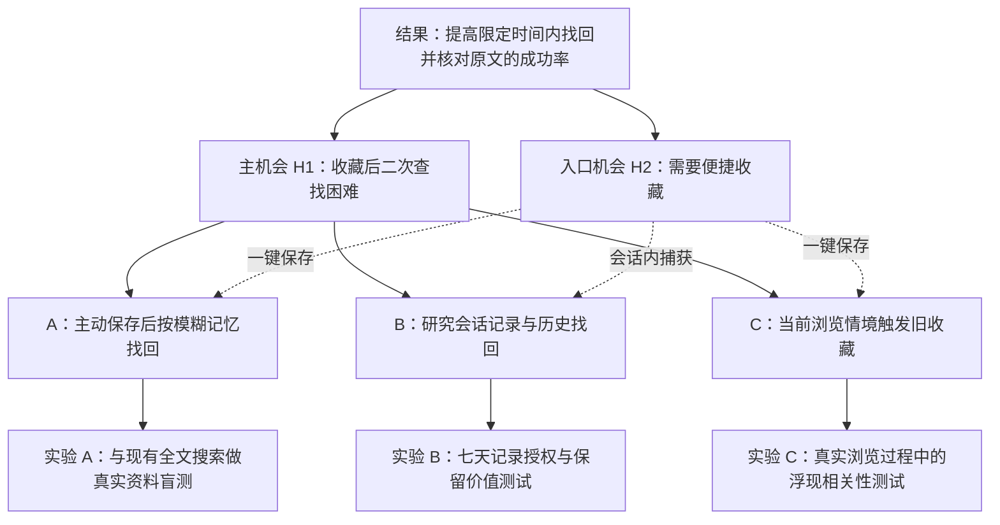

# 竞品分析报告

研究日期：2026-09-13。对象：经常阅读网页、收集行业信息的个人行业分析师。市场不限，仅分析桌面浏览器场景；浏览器扩展连接的网页应用、桌面资料库属于相关流程，移动端不纳入比较。

## 1. 决策结论与假设边界

- **建议优先验证方案 A：便捷收藏＋凭模糊记忆找回原文的浏览器助手。** 用户主动决定保存，系统保留正文与来源，支持关键词、自然语言及时间／站点条件查找，返回可核对的原文片段。
- 方案 B 是“研究会话内自动捕获＋历史找回”；方案 C 是“浏览相关内容时主动浮现旧收藏”。二者都有价值，但分别增加了“愿意授权自动记录”和“当前页面足以预测资料需求”的高风险假设。
- 这是基于公开资料的**优先验证选择**，不是经目标用户实验验证的市场最优解。A 必须证明相对现有全文搜索的增量，否则更合理的是使用或增强现成工具。

### 1.1 本次必须遵守的上游假设

| 编号 | 上游状态 | 本报告如何使用 |
|---|---|---|
| H1 | 保留：用户在收藏网页后二次查找困难 | 主机会；比较能否在需要时找回目标网页 |
| H2 | 保留：用户需要一种收藏网页的便捷方式 | 所有候选方案的入口约束；不预设便捷必须等于全自动 |
| H0 | 已被上游推翻：丢失信息是因为决定收藏的决策和操作成本高 | 不重新作为方案成立的理由 |

来源：[痛点确认.md](./痛点确认.md)。原文摘录：

> 保留下来的假设是“用户在收藏网页后二次查找困难”
>
> 用户需要1种收藏网页的便捷方式
>
> 不是因为“用户决定收藏某份网页的决策和操作成本高”

H1、H2 是本项目当前研究输入，不等于不可修正的事实。该文件未提供样本数、访谈明细或成功率；本报告不补造这些证据。H2 的“便捷入口需求”与 H0 的“丢失信息原因”是不同命题。

### 1.2 如何判读证据

- **官方能力**：官网或帮助文档说明存在什么流程，不代表效果经过独立验证。
- **用户证据**：公开社区中自述的使用经历，能发现有效条件与失败机制；身份、样本代表性及是否有商业关系无法完全验证。
- **分析推断**：从上述信息提出的取舍、设计与实验，均未实测。
- 本次为公开资料案头研究，未登录付费产品进行任务测试。用户评价集中于英文 Reddit，不能推出中国用户或行业分析师群体的普遍结论。未找到充分独立评价的模式明确标为 Unknown。
- 未比较融资、市场份额和获客渠道：它们不是本次 solution pattern 决策的必要依据。也未用旧版价格估算方案收益。

## 2. 竞品范围与真实流程

- 直接竞品定义：用户可以把它作为个人网页资料库，同时完成“保存网页”和“之后找回”
- 间接竞品定义：通过浏览历史或通用笔记工作流替代其中的任务

此分类服务本次 H1／H2；对方案 B 来说，Chrome 历史检索会成为直接替代。

### 2.1 五个直接竞品

| 产品与链接 | 对 H1／H2 的覆盖、定位 | 桌面端任务流程 | 关键边界与取舍 |
|---|---|---|---|
| [Raindrop.io](https://raindrop.io/) | 通用书签库；收藏入口＋标签／集合／全文查找 | 浏览网页 → 扩展保存 → 可选标签／集合 → 内容建立索引 → 搜索或筛选 → 打开原链接／已保存副本 | 用户保留明确筛选权；全文与永久副本属于 Pro 能力。存入库不等于索引已完成，也不保证每个网页都有副本。[官方说明](https://blog.raindrop.io/full-text-search-permanent-library-and-more/)、[筛选文档](https://help.raindrop.io/filters) |
| [Cubox](https://cubox.pro/) | 网页收藏、阅读与个人阅读记忆；同时覆盖两假设 | 扩展收藏或高亮 → 解析正文 → 库内快速查找／全文搜索 → 阅读原文；可开启搜索引擎页面显示相关收藏 | 捕获、检索入口较丰富；用户要理解默认快速查找与全文搜索的区别。官方也宣称 AI 自然语言检索，但本次未验证检索质量。[扩展文档](https://help.cubox.pro/save/5f70/)、[搜索文档](https://help.cubox.pro/manage/search/) |
| [mymind](https://mymind.com/) | 自动整理与视觉记忆检索 | 扩展一键保存 → 自动分析与标记 → 按记得的描述、颜色、日期或站点搜索 → 识别卡片 → 打开目标 | 减少分类维护；用户个人理解不一定与系统标签一致。视觉线索有帮助不代表专业文本检索同样准确。[扩展](https://mymind.com/browser-extensions)、[搜索指南](https://mymind.helpscoutdocs.com/article/48-using-search) |
| [Readwise Reader](https://readwise.io/read) | 面向重度阅读者的资料库与标注工作流 | 扩展保存网页／高亮 → Library 中阅读与标注 → 全文搜索 → 打开文档定位内容 → 将标注用于后续工作 | 深阅读与再使用链条完整，但引入资料库状态及阅读工作流。当前官方文档说明 Feed 不进入全文索引，搜索与 filtered views 仍是不同功能。[搜索说明](https://docs.readwise.io/reader/docs/faqs/searching)、[产品页](https://readwise.io/read) |
| [Recall](https://www.recall.it/) | 保存内容、AI 组织与浏览时再发现 | 扩展保存所选内容 → 生成摘要与关联 → 在知识库查找／对话；开启 Augmented Browsing 后，当前页面的概念触发旧内容关联 | 为主动再发现提供参考，但依赖先有相关收藏和准确关联。它不是 Microsoft Recall，也不是自动记录整个桌面的工具。浏览处理 local-first 不代表保存内容完全不上云。[官方 FAQ](https://www.recall.it/faq) |

**与本项目最接近的比较基线是 Raindrop 与 Cubox。** “一键保存＋AI 搜索”已有竞争；mymind 提醒我们检索不只依赖文字记忆，Reader 提醒我们检索范围必须清晰，Recall 展示了从主动搜索转向上下文触发的路径。这些是模式归纳，不是产品效果排名。

### 2.2 间接竞品与替代路径

| 替代品与链接 | 同一问题的替代流程 | 为什么是间接竞品／适用边界 |
|---|---|---|
| [Chrome AI 历史搜索](https://support.google.com/chrome/answer/15305774?hl=en-GW) | 开启功能 → 后续浏览时本地保存页面内容 → 在历史页用自然语言描述 → 打开匹配页面 | 不必先收藏，但主要解决“访问过的页面再找回”，没有等价的精选长期收藏承诺。该功能文档要求美国地区、英文 Chrome，并提示性能影响；不能推断全球或中文均可用 |
| [Gemini in Chrome 历史检索](https://support.google.com/chrome/answer/16716225?hl=en) | 启用 Gemini、登录个人账户并同步历史 → 描述曾看过的页面 → 从历史找回 | 是浏览器自带入口的替代压力。官方要求个人账户与历史同步，工作／学校账户及无痕模式不支持；不能将它与上行旧功能的限制混为一谈 |
| [Obsidian Web Clipper](https://obsidian.md/clipper) | 在网页打开扩展 → 提取正文／选区并套用模板 → 保存到本地 vault → 在笔记库查找、组织和引用 | 用户最终管理的是通用本地笔记库，浏览器是捕获入口。数据控制强，但需承担库、模板和笔记流程的维护；提取失败还可能要选区或自定义模板。[捕获文档](https://obsidian.md/help/web-clipper/capture)、[故障说明](https://obsidian.md/help/web-clipper/troubleshoot) |

不将“获取最新资讯”扩展为自动订阅全网或新闻推荐：上游确认的是保存与找回，尚未确认信息发现不足。

## 3. 已有 solution pattern 的取舍

以下为基于第 2 节能力与第 4 节用户经历的分析推断。同一产品可组合多个模式。

| 模式 | 获得什么 | 付出什么／failure mode | 有效的前提 |
|---|---|---|---|
| 手动保存＋标签／目录 | 保存范围明确，按个人研究上下文组织 | 标签持续维护；时间久了不记得命名或位置 | 用户有稳定分类线索，库内组织可以预测 |
| 手动保存＋正文索引／快照 | 不只搜标题，原网页变化后仍可能使用保存内容 | 解析、索引延迟、存储与付费成本；快照也可能失败 | 正文确实被保存、索引，搜索范围清楚 |
| 自动标签＋语义／视觉检索 | 能用不同于原文的线索找回，减少整理 | 漏召回、无关结果，个人语境与系统理解不一致 | 提供原文证据、过滤和关键词后备入口 |
| 阅读队列＋高亮＋回顾 | 重要片段更易被再次触达和使用 | 改变阅读习惯；未标注内容仍可能沉底 | 用户确实需要深阅读和回顾，而非只存作参考 |
| 浏览内容自动记录＋历史检索 | 忘记主动保存也有找回机会 | 捕获大量无关内容；授权、容量、性能、保留期限问题 | 用户接受记录范围，并能查看、暂停与删除 |
| 浏览时浮现相关旧内容 | 不依赖用户主动想起去搜索 | “主题相似”不等于“当前有用”；可能打断阅读 | 当前页面与任务相关，且库内已有高质量资料 |

**三个不同的“自动化”不可互换：自动整理已保存内容、自动推荐旧内容、自动保存访问内容。** 前两者的存在不能证明第三种需求成立。全文搜索改善 H1，也不能证明 H2 需要零操作。

## 4. 从真实用户声音判断有效条件与失败模式

下表从用户经历出发，再提炼机制。英文摘录保留原意，中文解释不把个体体验扩大成市场比例。日期来自帖子或检索可见时间；历史问题不默认仍然存在。

| 用户声音与原链接 | 能支持的判断 | 失败模式／设计启示 | 证据边界 |
|---|---|---|---|
| **U1，Raindrop，2025-06-07**：[Full text search vs tags](https://www.reddit.com/r/raindropio/comments/1l5s6jh/)。自述 Pro 用户：“The full text search does a decent job of locating my bookmarks by indexing the content.” 另一评论使用标签表达多种上下文 | 全文搜索和上下文标签均有正向使用证据 | 不必强迫用户在目录与全文检索之间二选一；保留个人线索作为补充 | 正向自述，无成功率、查询集与目标用户身份验证 |
| **U2，mymind，2026-06-04**：[Semantic Search (Beta)](https://www.reddit.com/r/mymindapp/comments/1twzowz/semantic_search_beta/)。用户说原搜索会漏掉相关项目；试用语义搜索后相关匹配更多，但“its main problem seems to be false positives” | 语义检索可能改善模糊线索召回；用户同时观察到噪声 | 增加召回不能牺牲到用户无法识别；要展示命中片段、允许缩小范围 | 针对当时 beta 的体验，不宣称是当前所有用户的默认功能或缺陷 |
| **U3，mymind，2024 年讨论**：[Everything database](https://www.reddit.com/r/PKMS/comments/1cx5ee8/)。评论者表示从 Raindrop 嵌套目录转向 mymind，更喜欢“tag-and-search functionality” | 对部分用户，标签与搜索比逐层目录更符合再查找习惯 | 值得测试用户实际记得的是主题、视觉还是目录位置 | 发帖者与评论者背景不能等同于行业分析师 |
| **U4，Raindrop，2025-05-04**：[Been using it wrong](https://www.reddit.com/r/raindropio/comments/1keoi0e/)。用户以为点击扩展后进入搜索，实际不断保存当前页面，积累大量无用书签 | 收藏与查找入口混淆本身会污染资料库 | 保存、搜索必须语义清楚；保存成功应可感知并可撤销 | 属于个体可用性经历；评论提供关闭自动保存的设置建议 |
| **U5，Reader，2026 年约 7 月**：[What improved search function](https://www.reddit.com/r/readwise/comments/1v1zwxz/what_improved_search_function/)。用户有 4,000 多 Inbox 文档和 3,000 多 Archive 文档，用位置语法搜索却未得到预期范围 | 用户把筛选与全文检索理解成同一入口 | 更强检索算法无法自动修复范围理解错误；统一入口应显式显示生效条件 | 回复解释二者是不同功能；[当前官方文档](https://docs.readwise.io/reader/docs/faqs/searching)仍说明其分离，不能归因为“全文算法完全失效” |
| **U6，Cubox，2024-02-24 评论**：[Cubox alternative to Reader](https://www.reddit.com/r/PKMS/comments/1amjo5z/)。长期用户肯定 deep linking，同时认为连续选标签时没有按已有结果缩小剩余标签选择 | 从外部工作流直达内容有价值；筛选反馈会影响找回效率 | 只提供很多标签还不够，必须帮助用户逐步收窄 | 历史体验，本次未复现该限制，不断言新版仍如此 |
| **U7，Raindrop，2026-06-10 至 12**：[Search function](https://www.reddit.com/r/raindropio/comments/1u1wxvl/the_search_function_on_this_thing_is_hilarious/)。用户报告大小写／子串查找异常，开发者回应 camelCase 索引问题，随后称修复，用户确认有效 | 基础字符串匹配故障就能破坏“资料仍在”的信任 | 语义能力之外仍需可靠的精确匹配回退 | **已在该帖确认修复的历史缺陷**，不能列为当前产品缺点 |
| **U8，Raindrop，2026-07-24／08-06**：[Fewer bookmarks than tagged](https://www.reddit.com/r/raindropio/comments/1v5g90m/raindrop_is_showing_me_fewer_bookmarks_than_what/)。用户看到标签计数多于结果数；开发者解释索引同步问题并计划强制重建 | “已保存但搜不到”也可能是索引状态问题 | 需要明确可搜索状态、失败重试与结果完整性提示 | 读到修复计划，但未取得该用户最终验证；当前状态 Unknown |

### 4.1 Design Principle

以下原则综合前述竞品能力与用户评价，分为解决 H1／H2 的核心设计、延伸价值和应避免的体验问题；延伸项是可选方向，尚未验证为本产品需求，历史反馈也不代表竞品当前仍有同样问题。

#### 维度一：为解决两个产品假设，可以借鉴的设计

- **便捷收藏（H2）**：借鉴 mymind、Cubox 的浏览器扩展，让用户一键保存网页，并将分类和补充笔记设为可选操作。原因是这些入口提供了便捷收藏的实现方式，而 H2 并未证明用户需要自动记录全部浏览内容。[来源：mymind 扩展](https://mymind.com/browser-extensions)、[Cubox 扩展](https://help.cubox.pro/save/5f70/)
- **清楚区分保存与查找（H2）**：收藏和搜索使用含义明确的独立入口，并为保存提供可见反馈与撤销操作。原因是 Raindrop 用户曾将扩展入口误认为搜索入口，因而无意保存了大量无用网页。[来源：U4 用户经历](https://www.reddit.com/r/raindropio/comments/1keoi0e/)
- **用多种记忆线索找回（H1）**：借鉴 Raindrop 的全文搜索与 mymind 的描述检索，同时保留关键词、时间和站点过滤，并展示原文命中片段。原因是用户既肯定全文搜索的效果，也报告语义搜索改善相关匹配但引入无关结果，因此需要互补的检索方式与核对依据。[来源：U1](https://www.reddit.com/r/raindropio/comments/1l5s6jh/)、[U2](https://www.reddit.com/r/mymindapp/comments/1twzowz/semantic_search_beta/)
- **让搜索范围符合用户预期（H1）**：把全文查找与筛选放在同一入口展示，并根据当前结果收窄可选标签。原因是 Reader 用户曾混淆搜索与筛选，而 Cubox 用户更认可 Raindrop 随筛选结果更新标签选项的方式。[来源：U5](https://www.reddit.com/r/readwise/comments/1v1zwxz/what_improved_search_function/)、[U6](https://www.reddit.com/r/PKMS/comments/1amjo5z/)
- **让收藏的可查找状态可信（H1）**：区分链接已保存、正文已获取与索引已完成，并为失败条目提供重试入口。原因是 Raindrop 用户曾遇到标签计数与搜索结果不一致的索引问题，仅显示“保存成功”不足以保证之后能够找到内容。[来源：U8，最终修复状态未确认](https://www.reddit.com/r/raindropio/comments/1v5g90m/raindrop_is_showing_me_fewer_bookmarks_than_what/)

#### 维度二：两个产品假设之外，可以加入的用户称赞功能

- **读后引用**：借鉴 Cubox，为文章、标题和高亮片段生成可从研究笔记中直接打开的链接。原因是长期用户明确称赞从 Obsidian 直达文章或片段的能力，这能将找回后的资料接入分析与写作流程。[来源：U6，原文“can deep link from obsidian to an article or directly to a highlight or a heading”](https://www.reddit.com/r/PKMS/comments/1amjo5z/)
- **长文阅读**：借鉴 Cubox 的阅读视图，为正确解析的长文提供可点击的目录与章节跳转。原因是用户明确肯定文章大纲能快速跳到所需章节，这改善的是打开文章后的阅读效率。[来源：U6，原文“quickly jump to the section you are looking for”](https://www.reddit.com/r/PKMS/comments/1amjo5z/)
- **重点回顾**：借鉴 Readwise，将已高亮的片段做成用户可自主开启的定期回顾。原因是用户肯定再次呈现高亮以供复习的想法，这提供了记忆巩固价值，但不能直接推出用户愿意接受默认提醒。[来源：同帖用户评价，原文“the idea of bringing back those highlights for a revision is great”](https://www.reddit.com/r/PKMS/comments/1amjo5z/)

#### 维度三：两个产品假设之外，应避免的 failure mode

- **迁移时丢失资料上下文**：导出应保留正文、来源、收藏时间、标签与笔记，并让用户能够检查导出完整性。原因是 Cubox 历史用户反馈导出缺少收藏日期且内容导出不够可靠，导致迁移后的排序与工作流受损。[来源：U6，原文“it will not export a \"date saved,\"”](https://www.reddit.com/r/PKMS/comments/1amjo5z/)
- **解析错误后无法修正**：为解析后的阅读副本提供重新抓取、手动修正与返回原网页的入口，并明确区分用户修改与原始内容。原因是 Cubox 用户曾报告部分网页解析不佳且无法编辑，错误因此延续到阅读和 Markdown 导出环节。[来源：U6，原文“you cannot manually edit the content once it has been parsed”](https://www.reddit.com/r/PKMS/comments/1amjo5z/)
- **数据用途不透明造成信任负担**：明确说明哪些内容留在本地、哪些会上云以及是否用于模型训练，并提供相应控制。原因是 Cubox 用户表达过阅读习惯可能被营销或训练使用的担忧，这说明数据用途不清会影响信任，但该评价不能证明竞品实际存在此类行为。[来源：U6，原文“the usual \"what do they do with my data?\" anxieties”](https://www.reddit.com/r/PKMS/comments/1amjo5z/)

## 5. Opportunity Solution Tree：三种候选方案

OST 方法依据：[Teresa Torres，Opportunity Solution Trees](https://www.producttalk.org/2016/08/opportunity-solution-tree/)。它将结果、用户机会、候选方案和假设实验关联起来；本次让三种方案竞争同一个 H1 机会，并共同满足 H2 的便捷入口约束。

**产品结果，待建立基线**：提高用户在真实研究任务中，120 秒内找回目标网页并核对所需原文的任务成功率。分母是预先登记的实际查找任务，不是查询次数，也不是收藏总量。计入找不到的任务，防止只统计成功查询。

图中的 B 对“未保存网页”的补救属于额外价值探索，不能用它代替 H1 的检验。C 的“用户没有主动想起去搜”是新增待验证假设，也未被 H1 自动确认。尚无证据支持的更细机会节点不写成已验证痛点。

### 5.1 方案 A：便捷保存与模糊记忆找回

- **流程**：用户点击保存 → 留下正文、链接和时间，可选高亮或一句用途 → 系统显示保存／索引状态 → 用户输入“上周看过的，讲企业 AI 采购放缓的那篇” → 返回候选原文片段、来源和日期 → 用户核对并打开原文。
- **产品假设**：目标用户虽不记得标题和目录，仍记得足够的概念或时间线索；结合全文与语义检索，可以明显优于其现有查找方式，且用户愿意采用这个入口。
- **PM 视角**：直接提升 H1，不把收藏数量作为价值；应先支持一份已有资料库导入，尽快验证增量。
- **设计视角**：保存与搜索分开表达；同一搜索入口显示范围与过滤条件；不强制补标签或用途。
- **工程视角**：先做内容保存与可搜索状态，再组合关键词和语义结果；用原文片段支撑匹配，失败时保留 URL 并说明未抓取正文。
- **取舍**：有意保留一次主动保存，仍会漏掉从未保存的网页；换来精选语料与清晰权限边界。主要竞争风险是现有工具已经足够好。

### 5.2 方案 B：研究会话内自动捕获与历史找回

- **流程**：用户开启一个研究会话并确认允许记录的网站 → 浏览过程中保存允许页面的内容与时间 → 会话结束可查看和删减 → 日后按主题、时间或会话找回 → 用户将需长期保留的内容转入收藏。
> “开启研究会话”指用户手动点击扩展里的“开始本次研究”按钮，然后开始浏览新网页或者继续原网页的浏览

两者不必同时发生，流程上是先开启记录，再记录后续浏览。 用户也可以已经在浏览某个网页时开启。此时是否立即保存当前页，需要进一步定义；原方案没有规定。点击“结束本次研究”后停止自动记录，但用户仍可继续浏览网页
  
- **产品假设**：用户愿意为防止漏存而开启有限记录；会话上下文足以让自动记录库可用，而不是变成新的历史记录堆。
- **PM 视角**：补救偶遇但未收藏内容，是比 H1 多一层的需求押注；单独测量这类任务，不与已收藏找回混算。
- **设计视角**：记录状态持续可见，支持暂停、排除站点、删除会话；用户无需逐页确认，但知道保留范围与期限。
- **工程视角**：需处理动态正文、页面版本、去重、本地容量和删除后的索引一致性；停留时长只能作为弱信号，不能等同于感兴趣。
- **取舍**：覆盖面扩大，但资料噪声、设备负担和授权负担更高。最初采用显式会话范围，比直接推断全部长期兴趣更易检验。

### 5.3 方案 C：浏览情境触发的旧收藏助手

- **流程**：用户一键保存有价值网页 → 后续浏览新文章 → 系统匹配旧收藏 → 在侧栏安静显示少量关联原文与“为何相关” → 用户展开、引用或标记无关；保留手动查找兜底。
- **产品假设**：研究过程中，当前网页能代表即时资料需求；在此时出现的旧收藏比用户主动搜索更及时，且不会造成明显干扰。
- **PM 视角**：目标是旧资料被再次使用，不是侧栏曝光或点击；需证明触发能帮助真实任务。
- **设计视角**：默认不弹窗，不自动移动阅读位置；原文可核对，用户可关闭某主题提示。
- **工程视角**：需要低延迟上下文提取与相关性判断；冷启动资料库、同词异义和过时版本会降低价值。
- **取舍**：无需用户先想起某篇文章，但当前正在看的内容可能与写报告的真实需求不同；错误浮现会占用注意力。Recall 已展示同类模式，不能称为市场空白。

## 6. 按 Value／Usability／Feasibility 检查假设

以下信心是对**本项目假设**的定性判断，不是概率。Riskiest 依据“若不成立是否摧毁核心价值 × 当前证据有多弱”选择，不以开发难度代替风险。全部实验与门槛均是建议，尚未执行；数值不是行业基准。

### 6.1 方案 A

| 风险 | 需成立的假设与当前信心 | 如何证伪／建议通过条件 |
|---|---|---|
| **Value：Riskiest** | 模糊记忆检索相对用户现有全文搜索有足够增量，促使其持续使用新入口。低；U1 表明现有工具可能已经有效，U2 只提供部分支持 | 招募 8–12 名目标分析师，使用其真实收藏和自然形成的查找任务，对比现有工具、关键词基线与 A；交错顺序并避免重复题学习。建议成功率较现有工具提高至少 15 个百分点，且 4 周内至少半数参与者在两个不同周主动回用；任一未满足则不认定成立 |
| Value | 用户愿意一键保存，但不愿被迫填写额外字段。中；H2 是输入，非本次实验结果 | 记录真实阅读中放弃保存的原因；若强制补充信息才有良好检索效果，则方案违背便捷前提，应重设计 |
| Usability | 用户能分清保存、保存失败和可搜索状态，知道输入模糊描述并核对原文。中低；U4／U5 是反例提示 | 5–8 人无指导任务测试；至少 80% 独立完成保存到找回，不能出现将失败理解为成功的严重错误；小样本仅用于发现问题 |
| Feasibility | 对目标网站能稳定提取正文，并在合理时间内返回有根据的结果。中低；竞品能力说明可行方向，未证明我们的实现 | 选取不少于 100 个实际目标网页，覆盖中英文、动态内容与登录后可见页面；建议可用正文率 ≥95%，缺失内容必须可识别，1 万篇库内查询 p95 ≤2 秒。失败页面分层报告，不以平均值掩盖某类完全不可用 |

**为何 A 的 Value 最险**：工程实现一个搜索入口不等于用户会迁移。若它只是与 Raindrop／Cubox 表现相当，独立新产品的采用理由不足。

### 6.2 方案 B

| 风险 | 需成立的假设与当前信心 | 如何证伪／建议通过条件 |
|---|---|---|
| **Value：Riskiest** | 用户在知道实际捕获范围后仍愿意连续开启，且额外记录确实补救重要遗漏。低；H2 未验证记录授权，也缺少独立成效证据 | 8–12 名分析师进行七天研究会话试验，参与者可随时关闭；建议至少 60% 在看到实际记录后仍于第二周继续开启，且至少半数参与者找回一份本来未收藏但后来确实需要的资料；仅表示“喜欢概念”不算通过 |
| Value | 自动捕获的收益超过筛除噪声的时间，用户不必每天清库。低 | 比较漏存挽回与清理时间；建议每周清理中位数 ≤5 分钟，且 H1 的找回成功率不低于 A；否则捕获更多反而稀释价值 |
| Usability | 用户明确知道何时记录、如何排除和删除，能够独立完成。低至中 | 测试开启、暂停、排除站点、删除会话；任一参与者误以为暂停后仍会保存／删除仅藏起内容，都需修复并重测 |
| Feasibility | 连续捕获不会明显拖慢浏览，删除能同步移除正文与索引。低；尚无本地实现或性能数据 | 在真实设备与多标签页负载下比较基线；建议页面加载 p95 劣化 ≤10%，删除检查零残留；报告每小时存储量。无法满足则缩小站点与内容范围 |

**为何 B 的 Value 最险**：即使全自动技术可行，用户不愿保持开启或找不回额外有用内容，整个模式就失去优势。授权意愿也是行为改变成本，不能只归到设置页面的可用性。

### 6.3 方案 C

| 风险 | 需成立的假设与当前信心 | 如何证伪／建议通过条件 |
|---|---|---|
| **Value：Riskiest** | 当前页面能预测用户此刻需要的旧资料，主动浮现能帮助任务而非增加干扰。低；目前主要为官方能力证据 | 以 8–12 名分析师实际研究任务做受控试验，由人工先模拟候选浮现；建议前 3 条“此刻对任务有用”占比 ≥70%，至少半数参与者在真实任务中使用过浮现原文；只点击不算价值 |
| Value | 用户愿意让侧栏持续存在，且有足够的历史资料形成关联。低 | 连续两周观察，建议主动关闭率 <20%；按资料库大小分层；冷启动用户无收益时不能用重度用户平均表现掩盖 |
| Usability | 用户能理解关联原因、辨认旧资料与当前页面，并关闭无关提示。中低 | 无指导任务中验证来源辨认、展开原文与关闭操作；若用户误将旧观点当作当前文章结论，则必须调整呈现 |
| Feasibility | 可以低延迟判断语境并避免实体歧义，结果包含可靠来源。低至中 | 真实网页集测试中英文名称、同词异义与版本冲突；建议侧栏结果 p95 ≤2 秒，来源链接与片段映射正确率 100%；相关性单独测，不被链接正确率替代 |

**为何 C 的 Value 最险**：实体相同、主题相近只是技术上的关联；能否在那个时刻帮助用户推进研究任务，才决定其存在价值。

## 7. 选择方案 A：理由、边界与下一步

### 7.1 同一标准下比较

| 决策标准 | A：模糊记忆找回 | B：会话自动捕获 | C：情境浮现 |
|---|---|---|---|
| 对 H1 的直接性 | 高：显式完成找回任务 | 中：能检索，但新增捕获不是 H1 的充分解法 | 中：依赖当前情境触发 |
| 对 H2 的满足方式 | 一次明确保存动作 | 一次开启会话，之后自动记录 | 一次明确保存动作 |
| 本次独立用户证据 | 有部分正向及失败证据 | 不足 | 不足 |
| 额外行为改变 | 导入资料与使用新搜索入口 | 允许持续记录与管理范围 | 接受阅读中出现旧资料 |
| 可快速验证性 | 高：可在现有库上比较找回结果 | 中：需要连续使用与真实遗漏事件 | 中：需真实任务情境 |
| 最主要商业威胁 | 现有全文搜索足够好 | 浏览器原生历史检索 | 已有上下文浮现产品 |

该表是证据驱动的定性比较，不伪装成精确打分。H1 直接性和增量验证优先于自动化程度。

### 7.2 最佳方案的具体定义

优先选择 **A：面向网页研究的原文找回助手**。主张是“凭你还记得的线索，找到并核对曾保存的那篇资料”。最初只保留以下闭环：

1. 在桌面浏览器一键保存网页，展示保存与索引状态，可撤销。
2. 导入一份已有收藏库；明确只有 URL、抓取失败及可全文搜索的条目，避免导入完成制造假象。
3. 在同一入口支持描述、关键词与可见的时间／站点过滤。
4. 返回少量候选及原文命中片段，能核对来源与打开保存内容；不把生成答案当作找回成功。
5. 记录是否找到正确原文、耗时与失败原因，按用户和任务类型分析。

**差异化仍待证明**：不是宣称“别人没有 AI”，而是在目标分析师的中英文真实收藏中，以可解释的原文命中、清楚的搜索范围和索引状态证明更可靠。前三项已有竞品覆盖，组合是否足够形成采用动力必须实测。

### 7.3 什么证据会改变推荐

- 若 A 相对现有工具没有增量：停止独立新产品假设，优先采用现有工具，或把确有需求的能力做成已有库的扩展。
- 若实际失败主要来自未保存而非已收藏找不回，且用户愿持续开启记录：修正机会优先级，将 B 提升为首选。
- 若用户大多不会主动搜索，但情境浮现能促成可观察的资料使用且干扰低：提高 C 的优先级。
- 若失败集中在正文抓取、索引缺失：先解决资料可用性，再评估语义模型；更换检索模型不能找回没有进入库的内容。

**建议下一步**：先执行 A 的 Value 假设对照测试，同时用低成本会话原型和人工浮现测试 B、C 的 Riskiest 假设。当前结论只授权研究建议，不代表这些实验已经执行或产品已验证。

## 8. 关键来源与对应内容摘录

除本节外，竞品表和用户证据表均提供直接链接。本节摘录用于快速核对最影响判断的原文；官方宣传与用户体验已分开。

| 来源 | 原文短摘录 | 对应结论 |
|---|---|---|
| [Cubox 搜索文档](https://help.cubox.pro/manage/search/) | “快速查找默认匹配收藏卡片的标题、描述、链接。” | 快速查找不是默认全文搜索 |
| [Cubox 扩展文档](https://help.cubox.pro/save/5f70/) | “在搜索引擎中显示相关结果” | 已有把旧收藏嵌入浏览器搜索流程的方案 |
| [Raindrop 全文与副本说明](https://blog.raindrop.io/full-text-search-permanent-library-and-more/) | “Not every bookmark can be saved” | 副本能力有边界，不能将保存成功等同于正文可用 |
| [Reader 搜索文档](https://docs.readwise.io/reader/docs/faqs/searching) | “Currently, filtered views and full-text search are distinct features.” | 搜索与筛选存在不同交互范围 |
| [mymind 搜索指南](https://mymind.helpscoutdocs.com/article/48-using-search) | “Search for anything you can remember” | 以用户残余记忆作为查找入口的官方定位 |
| [Recall FAQ](https://www.recall.it/faq) | “content you choose to save” | 自动关联不等于全量自动记录 |
| [Chrome AI 历史搜索](https://support.google.com/chrome/answer/15305774?hl=en-GW) | “you must be located in the US and use Chrome in English” | 该功能文档的地区／语言边界 |
| [Obsidian Web Clipper](https://obsidian.md/help/web-clipper) | “saves content locally to your Obsidian vault” | 本地资料控制是另一种取舍 |
| [OST 原作者说明](https://www.producttalk.org/2016/08/opportunity-solution-tree/) | “Choose three solutions to explore further.” | 围绕共同机会探索三个方案并测试假设 |

访问与证据限制：部分 Reddit 页面主帖可打开但评论展示不完整，评论摘录同时依赖搜索工具返回的公开索引文本；未使用不可见评论推断结论。U2 为 beta 历史反馈，U6 为较早版本体验，U7 已确认修复，U8 缺少最终验证。这些限制直接影响结论强度，不能在后续 PRD 中删掉后改写为确定事实。
